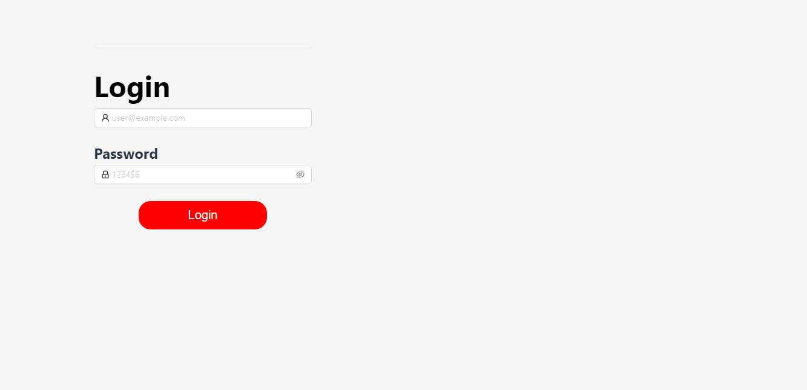

# Hub de entretenimiento
# Mayra Guadalupe Arias López

# ---------------------------- 
# 1. Resumen

Este proyecto consiste en un hub de entretenimiento desarrollado utilizando React y diseñado con antdesign, el cual permite a los usuarios descubrir y explorar películas, ofreciendo una interfaz atractiva y fácil de usar. La aplicación consume datos de una API externa para obtener información sobre las películas y sus trailers.

# Funcionalidades:

1.-Búsqueda de películas: Los usuarios pueden buscar películas por título.
2.-Listado de películas: Se muestra una lista de películas con información básica como título, póster y trailer.
3.-Reproductor de trailers: Se integra un reproductor para mostrar trailers de las películas. El reproductor consume la URL del trailer desde la API externa tomada desde https://developer.themoviedb.org/.

# Herramientas y Tecnologías:

React: Biblioteca de JavaScript para crear interfaces de usuario.
Ant Design: Biblioteca de componentes de interfaz de usuario para React, que proporciona un conjunto de elementos prediseñados y con estilo para crear interfaces consistentes y atractivas.
API externa: Servicio web que proporciona información sobre películas y trailers.
Herramientas y Tecnologías:
Axios: Biblioteca para realizar solicitudes HTTP.
Node.js: Entorno de ejecución de JavaScript.
npm: Gestor de paquetes para JavaScript.

# ---------------------------- 
# 2. Requerimientos técnicos:

## Creación de proyecto
create-react-app

## Peticiones
Axios-http
https://axios-http.com/docs/intro

## UI
Ant-design
https://ant.design/

## Router
React-Router
https://reactrouter.com/en/main

# ---------------------------- 
# 3. ¿Cómo instalar?

# IMPORTANTE
Antes de levantar el proyecto es necesario correr el siguiente comando para instalar todas nuestras dependencias de node con:
npm install

Una vez instaladas nuestras dependencias para levantar nuestro proyecto en un entorno local es necesario colocar el siguiente comando:
npm start

# --------------------------------------

Dependencias Instaladas
npm i antd
npm i axios
npm i react-youtube
npm i react-router-dom

# --------------------------------------

# ---------------------------- 
# 4. Capturas de pantalla (5)

1.- Login:
Interfaz que se renderiza al levantar el proyecto, actualmente no consume ninguna API de usuarios por lo que para ingresar a la interfaz principal de la aplicacion no es necesario ingresar credenciales, solo basta con presionar el boton "Login".

2.- Layout principal:

al logearse ek usuario podrá ver la pantalla principal que incluye, un buscador de peliculas, un reproductor de trailers de la pelicula segun sea su eleccion y el catalogo de peliculas, es probable que  en la primer pantalla no encuentres tu pelicula favorita, puedes intentar buscando en el bucador disponible.

3.- Reproductor de trailers

La aplicación cuenta con un reproductor de video donde el usuario podra visualizar el trailer de la pelicula seleccionada, esta funcionalidad logro conseguirse con la instalacion de la librería "YouTube".

4.- Catalogo de películas

En la aplicacion podra visualizarse a manera de cuadricula el catalogo de peliculas disponibles en su primera carga, la pelicula deseada puede encontrarse en el buscador localizado en la parte superior.

5.- Buscador de peliculas

Es muy probable que el usuario necesite localizar dentro dle catalogo de peliculas, la pelicula deseada, en caso de no visualizarse en la cuadricula en su primer recarga, seguramente se podrá localizar en el buscador, siempre y cuando se encuentre en los endpoints de la API

# ---------------------------------------------
# 5 ¿Cómo se trabajó? Procedimiento que se hizo

1. Configuración del Entorno de Desarrollo:

1.1-Se instaló Node.js y npm, herramientas necesarias para ejecutar aplicaciones JavaScript.
2.1-Se creó un proyecto React usando create-react-app.
3.1-Se instaló la biblioteca Ant Design utilizando npm install antd.

2. Diseño de la Interfaz de Usuario:

2.1-Se utilizaron componentes de Ant Design para crear la estructura de la aplicación

3. Integración de la API:

3.1-Se identificó una API externa que proporciona información sobre películas y trailers.
3.2-Se crearon solicitudes HTTP utilizando la biblioteca axios para obtener datos de la API.
3.3-Se procesaron los datos obtenidos de la API para mostrarlos en la interfaz de usuario.

# ---------------------------- 
# 6 Sprint review

|1.- Qué salió bien | 2.-Que puedo hacer diferente | 3.-Que no salió bien
-----------------------------------------------------------------
1.- Logré levantar un proyecto con react implementando las tecnologías solicitadas, agregando un plus a mi proyecto como fue, el consumo de una API de peliculas desde "the movie db", que otorga otra presentación y complejidad a la aplicación.

2.- Pudieron haberse implementado elementos para mejorar la experiencia de usuario, por ejemplo:
un loader para indicar cargas de datos para el usuario, mejorar la funcionalidad del buscador, es decir que al teclear cada palabra la busqueda se haga automáticamente, el color y el tamaño de la letra para la descripcion de cada pelicula, o la posicion de los botones. En cuanto al código puedo haberse implementado una mejor limpieza con el manejo de archivos y carpetas, y utilizar variables de entorno para proteger los datos de la API.

3.- Muy probablemente el manejo de mis tiempos no fue lo ideal, ya que debiá llevar de manera simultanea mi avance del curso y presentar ademas un buen proyecto, en general hay muchas cosas en este poryecto que evidentemente pueden mejorar y estoy abierta a cada propuesta.

# ---------------------------------------------------
## DOCUMENTACION DE REACT POR DEFECTO
# ---------------------------------------------------

# Getting Started with Create React App

This project was bootstrapped with [Create React App](https://github.com/facebook/create-react-app).

## Available Scripts

In the project directory, you can run:

### `npm start`

Runs the app in the development mode.\
Open [http://localhost:3000](http://localhost:3000) to view it in your browser.

The page will reload when you make changes.\
You may also see any lint errors in the console.

### `npm test`

Launches the test runner in the interactive watch mode.\
See the section about [running tests](https://facebook.github.io/create-react-app/docs/running-tests) for more information.

### `npm run build`

Builds the app for production to the `build` folder.\
It correctly bundles React in production mode and optimizes the build for the best performance.

The build is minified and the filenames include the hashes.\
Your app is ready to be deployed!

See the section about [deployment](https://facebook.github.io/create-react-app/docs/deployment) for more information.

### `npm run eject`

**Note: this is a one-way operation. Once you `eject`, you can't go back!**

If you aren't satisfied with the build tool and configuration choices, you can `eject` at any time. This command will remove the single build dependency from your project.

Instead, it will copy all the configuration files and the transitive dependencies (webpack, Babel, ESLint, etc) right into your project so you have full control over them. All of the commands except `eject` will still work, but they will point to the copied scripts so you can tweak them. At this point you're on your own.

You don't have to ever use `eject`. The curated feature set is suitable for small and middle deployments, and you shouldn't feel obligated to use this feature. However we understand that this tool wouldn't be useful if you couldn't customize it when you are ready for it.

## Learn More

You can learn more in the [Create React App documentation](https://facebook.github.io/create-react-app/docs/getting-started).

To learn React, check out the [React documentation](https://reactjs.org/).

### Code Splitting

This section has moved here: [https://facebook.github.io/create-react-app/docs/code-splitting](https://facebook.github.io/create-react-app/docs/code-splitting)

### Analyzing the Bundle Size

This section has moved here: [https://facebook.github.io/create-react-app/docs/analyzing-the-bundle-size](https://facebook.github.io/create-react-app/docs/analyzing-the-bundle-size)

### Making a Progressive Web App

This section has moved here: [https://facebook.github.io/create-react-app/docs/making-a-progressive-web-app](https://facebook.github.io/create-react-app/docs/making-a-progressive-web-app)

### Advanced Configuration

This section has moved here: [https://facebook.github.io/create-react-app/docs/advanced-configuration](https://facebook.github.io/create-react-app/docs/advanced-configuration)

### Deployment

This section has moved here: [https://facebook.github.io/create-react-app/docs/deployment](https://facebook.github.io/create-react-app/docs/deployment)

### `npm run build` fails to minify

This section has moved here: [https://facebook.github.io/create-react-app/docs/troubleshooting#npm-run-build-fails-to-minify](https://facebook.github.io/create-react-app/docs/troubleshooting#npm-run-build-fails-to-minify)
